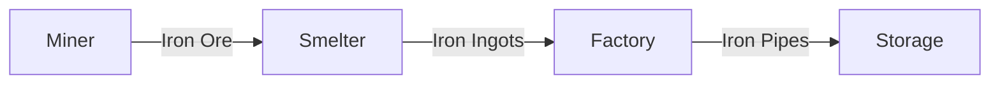

# Industrial Agent Simulation 🏭

[](https://www.python.org/downloads/)
[](https://en.wikipedia.org/wiki/Agent-based_model)

An asynchronous agent-based simulation of an industrial supply chain with Miner, Smelter, Factory, and Storage agents.

## Features ✨
- Agent-based modeling with `mango` framework
- Complete supply chain simulation from raw materials to finished goods
- Asynchronous processing with `asyncio`
- Material transfer validation between agents
- Logging of all transactions
- Target-based termination condition

## Architecture Overview


# Installation 
### Prerequisites
- Python 3.7+
- pip

### Setup
1. Clone the repository:
```bash
git clone https://github.com/OrionFlame1/mangoFactory.git
cd industrial-agent-simulation
```
2. Install dependencies:
```bash
pip install -r requirements.txt
```

# Usage
### Running the Simulation
```bash
python main.py
```

### Expected Output
```
Miner mined 10 iron ores. Total: 10
Miner sent parcel: Parcel(Quantity: 10, Material: Iron, Item: Ore, Message: mined)
Smelter is smelting 20 iron ores into 5 iron ingots...
Factory is crafting 5 iron pipes...
...
Storage reached target of 10 iron pipes!
```

# Agent Classes
### Miner
- Mines iron ore (10 units every 5 seconds)
- Sends ore to Smelter
- Validates outgoing parcels

### Smelter
- Receives iron ore from Miner
- Smelts ore into ingots (20 ore → 5 ingots)
- Sends ingots to Factory
- Validates material transformations

### Factory
- Receives iron ingots from Smelter
- Crafts pipes (10 ingots → 5 pipes)
- Sends pipes to Storage
- Manages production cycles

### Storage
- Receives pipes from Factory
- Tracks total pipes collected
- Stops simulation when target is reached
- Implements termination condition

# Validation Rules
1. Miner → Smelter: Allowed (Ore transfer)
2. Smelter → Factory: Allowed (Ingot transfer)
3. Factory → Storage: Allowed (Product transfer)
4. Reverse flows: Prohibited by validation

# Future Enhancements
- Add copper production chain
- Implement resource constraints
- Add real-time visualization
- Introduce random failures/events
- Expand validation rules
- Add unit tests

# Roadmap
- [ ] Add copper production chain
- [ ] Implement resource constraints
- [ ] Add real-time visualization
- [ ] Introduce random failures/events
- [ ] Expand validation rules
- [ ] Add unit tests